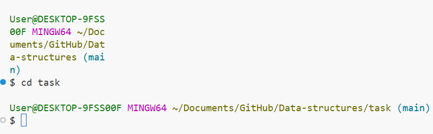
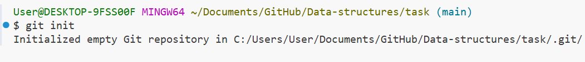
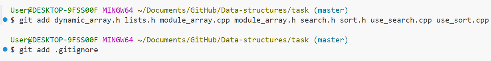
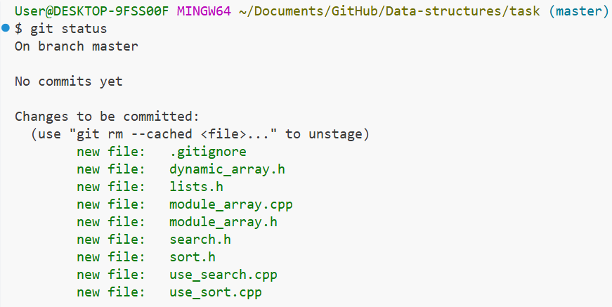
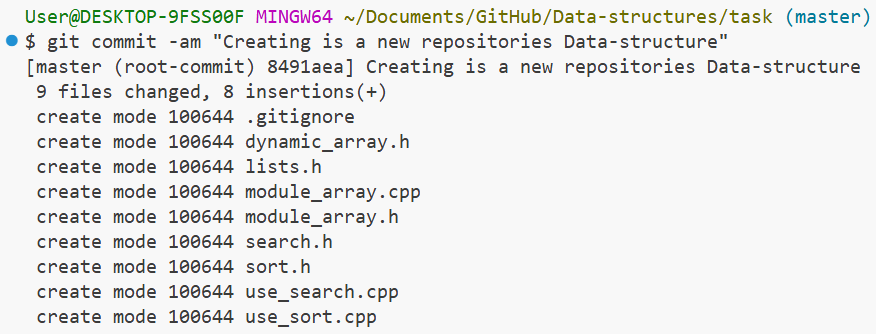
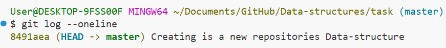

# Применение системы контроля версий git  

1. перешла в нужную директоию  
  
<!--  -->

2. инициализировала git-репозиторий  

<!-- -->  

3. добавила файлы для отслеживания   
    
<!--  -->  

4. проверила статус  
  
<!--  --> 

5. первый коммит  
  
<!--  -->  

6. убедилась что создала коммит 
  
<!--  -->  

